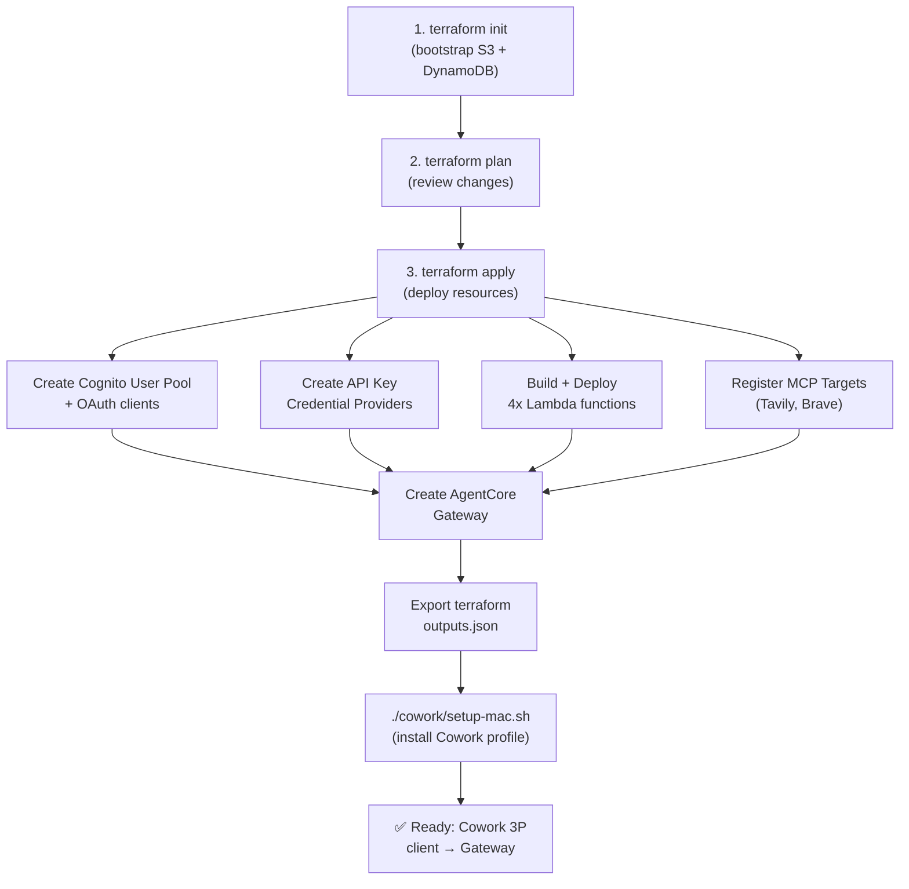

# WebSearch Tool Gateway — Technical Architecture

**Version**: 1.0 | **Date**: May 2026 | **AWS Region**: ap-northeast-2 (Seoul)

## Executive Summary

WebSearch Tool Gateway is a fully managed, Infrastructure-as-Code system that integrates 6 web search engines (Serper, Exa, DuckDuckGo, Perplexity, Tavily, Brave) into AWS Bedrock AgentCore and provides unified access via Cowork 3P client integration.

**Key Metrics**:
- **4 deployment tracks**: Infra (Terraform), Tools (Python Lambda), Dashboard (Next.js), Cowork (setup automation)
- **6 Terraform modules**: auth, gateway, identity-providers, gateway-lambda-tool, gateway-mcp-target, observability
- **6 search engines**: 4 Lambda-based + 2 external MCP HTTP targets
- **Zero-trust architecture**: JWT-based auth with Cognito allowed-clients access control
- **Full observability**: CloudWatch Logs + Metrics + OTEL tracing

---

## System Architecture

```
┌─────────────────────────────────────────────────────────────────────┐
│                                                                     │
│                  Cowork 3P Client (macOS/Windows)                  │
│              (Managed Preference + JWT Token Rotation)              │
│                                                                     │
└──────────────────────────────────┬──────────────────────────────────┘
                                   │ HTTPS + Custom JWT
                                   │ (via agentcore-token helper)
                                   ▼
┌──────────────────────────────────────────────────────────────────────┐
│                                                                      │
│          AWS Bedrock AgentCore Gateway (Custom JWT + MCP)           │
│  ┌─────────────────────────────────────────────────────────────┐   │
│  │ Gateway                                                     │   │
│  │  - JWT validation (Cognito OIDC issuer)                   │   │
│  │  - Allowed-clients access control                          │   │
│  │  - Tool/MCP routing                                        │   │
│  └─────────────────────────────────────────────────────────────┘   │
│                                                                      │
└──────────┬──────────────┬──────────────┬─────────────────┬──────────┘
           │              │              │                 │
    Lambda │ Targets   HTTP │ Targets  Lambda │ Targets   HTTP │ Others
           │              │              │                 │
    ┌──────▼──────┐  ┌────▼─────┐  ┌────▼─────┐  ┌────▼──────┐
    │   Serper    │  │  Tavily  │  │   Exa    │  │   Brave   │
    │  (Gateway   │  │ (Gateway)│  │ (Gateway)│  │ (Gateway) │
    │   Lambda)   │  │  → HTTP  │  │ Lambda)  │  │  → HTTP   │
    └─────┬──────┘  └────┬─────┘  └────┬─────┘  └────┬──────┘
          │              │              │             │
    ┌─────▼──────────────┴──────────────┴─────────────▼────┐
    │                                                      │
    │        Search Engine Integration Layer              │
    │   (DuckDuckGo, Perplexity also as Lambda)          │
    │                                                      │
    └─────────────────┬───────────────────────────────────┘
                      │
              ┌───────▼────────┐
              │  CloudWatch    │
              │  - Logs        │
              │  - Metrics     │
              │  - Vended Logs │
              │  - OTEL Traces │
              └────────────────┘
```

---

## Component Details

### 1. AWS Bedrock AgentCore Gateway

**Purpose**: Central MCP router with JWT-based access control.

**Responsibilities**:
- Accept MCP protocol requests (tool list, tool call)
- Validate JWT tokens (Cognito OIDC issuer)
- Enforce access via the allowed-clients list (Cognito M2M)
- Route to Lambda targets or external HTTP MCP servers
- Return normalized MCP responses

**Configuration**:
```terraform
resource "aws_bedrockagentcore_gateway" "main" {
  name = "${var.project_name}-gateway"
  
  # Custom JWT authentication
  type = "CUSTOM_JWT"
  
  # MCP server targets (mixed: Lambda + HTTP)
  mcp_server_targets = [
    # Lambda targets for: serper, exa, duckduckgo, perplexity
    # HTTP targets for: tavily, brave
  ]
}
```

---

### 2. Search Tools (Lambda)

**4 Search Tools as AWS Lambda functions**:

| Tool | Engine | Auth | Lambda Runtime | Latency | Cost |
|------|--------|------|-----------------|---------|------|
| **serper** | Google Serper | API Key (via Identity) | Python 3.12, arm64 | 500ms avg | $0.001-0.005/call |
| **exa** | Exa (deterministic) | API Key (via Identity) | Python 3.12, arm64 | 800ms avg | $0.002-0.01/call |
| **duckduckgo** | DuckDuckGo | None (public API) | Python 3.12, arm64 | 400ms avg | Free |
| **perplexity** | Perplexity Sonar | API Key (via Identity) | Python 3.12, arm64 | 1200ms avg | $0.005-0.02/call |

**Common Interface** (SearchResponse contract):

```python
{
  "results": [
    {"title": str, "url": str, "snippet": str},
    ...
  ],
  "engine": str,        # "serper" | "exa" | "duckduckgo" | "perplexity"
  "latency_ms": int,    # Time to retrieve results
  "error": str | None   # Error message if failed
}
```

**API Key Management**:

Lambda handlers retrieve API keys via **AgentCore Identity Provider API**:

```python
# tools/_shared/identity.py
def get_api_key(provider_name: str) -> str:
    client = boto3.client("bedrock-agentcore")
    response = client.get_resource_api_key(
        identityProviderArn=os.environ["IDENTITY_PROVIDER_ARN"],
        workloadToken=os.environ["WORKLOAD_TOKEN"],
        resourceIdentifier=provider_name  # "serper", "exa", etc.
    )
    return response["apiKey"]
```

**Environment Variables** (injected by Terraform):

```bash
WORKLOAD_TOKEN              # Provided by AgentCore at runtime
IDENTITY_PROVIDER_ARN       # Configured Cognito Identity provider ARN
AWS_REGION                  # ap-northeast-2
PROJECT_NAME                # websearch-gateway
ENVIRONMENT                 # dev
```

---

### 3. External MCP Targets (HTTP)

**2 Search Tools as External HTTP MCP Servers**:

| Tool | Protocol | Endpoint | Auth |
|------|----------|----------|------|
| **tavily** | HTTP MCP | https://api.tavily.com/search | Bearer API Key |
| **brave** | HTTP MCP | https://api.search.brave.com/mcp | Bearer API Key |

**Gateway Registration**:

```terraform
resource "aws_bedrockagentcore_gateway_target" "tavily" {
  gateway_id = aws_bedrockagentcore_gateway.main.id
  
  type = "MCP_SERVER"
  
  configuration = {
    server = {
      type = "stdio"  # or "http"
      endpoint = "https://api.tavily.com/search"
    }
    credentials = {
      credential_provider_arn = aws_bedrockagentcore_api_key_credential_provider.tavily.arn
    }
  }
}
```

---

### 4. Authentication (Cognito)

**Purpose**: OAuth 2.0 + M2M token issuance for Cowork clients.

**Components**:

1. **User Pool** (websearch-gw-up):
   - Standard OAuth 2.0 scopes (openid, email, profile)
   - Custom resource server (`bedrock-agentcore-control`)
   - 2 client types:
     - **Web Client** (Cowork interactive): Authorization Code + PKCE
     - **M2M Client** (Service-to-service): Client Credentials flow

2. **OIDC Configuration**:
   - Token endpoint: `https://{cognito_domain}/oauth2/token`
   - JWKS endpoint: `https://{cognito_domain}/oauth2/token/.well-known/jwks.json`
   - Issuer URL: `https://{cognito_domain}/`

**JWT Token Structure**:

```json
{
  "sub": "xxxxxxxx-xxxx-xxxx-xxxx-xxxxxxxxxxxx",
  "cognito:username": "user@example.com",
  "aud": "xxxxxxxx...",
  "token_use": "id",
  "auth_time": 1234567890,
  "iss": "https://cognito-idp.ap-northeast-2.amazonaws.com/ap-northeast-2_xxxxxxxx",
  "exp": 1234567890,
  "iat": 1234567890
}
```

---

### 5. Identity Providers (API Key Management)

**Purpose**: Store and vend API keys to Lambda functions.

**Architecture**:

```terraform
resource "aws_bedrockagentcore_api_key_credential_provider" "serper" {
  name = "serper-provider"
  
  # Stores API key reference (not the key itself)
  # Key retrieved at runtime via AgentCore Identity API
}
```

**Storage Flow**:

1. Terraform stores API key in `terraform.tfvars` (marked `sensitive=true`)
2. Lambda retrieves key via:
   ```
   bedrock-agentcore:GetResourceApiKey(
     identityProviderArn="arn:aws:bedrock-agentcore:ap-northeast-2:...",
     resourceIdentifier="serper",
     workloadToken=<WORKLOAD_TOKEN>
   )
   ```
3. Key cached in Lambda memory for warm starts

**API Key Variables** (terraform.tfvars):

```hcl
serper_api_key       = "..."  # Google Serper API key
exa_api_key          = "..."  # Exa API key
perplexity_api_key   = "..."  # Perplexity API key
tavily_api_key       = "..."  # Tavily API key
brave_api_key        = "..."  # Brave API key
```

---

### 6. Observability (CloudWatch)

**Components**:

1. **Log Group**: `/aws/bedrock-agentcore/websearch-gateway-dev`
   - Retention: 30 days (configurable)
   - Log class: STANDARD
   - Vended logs: Enabled (CloudTrail integration)

2. **Metrics** (custom namespace: `Bedrock/AgentCore`):
   - `GatewayInvocations` — Count of MCP calls
   - `GatewayLatency` — Latency percentiles (p50, p90, p99)
   - `ToolErrors` — Error count by tool + error type

3. **Traces** (OTEL):
   - Lambda spans: `get_serper_api_key`, `query_serper`, etc.
   - Gateway spans: `jwt_validation`, `tool_invocation`
   - Trace IDs propagated across services (X-Trace-ID header)

---

## Cowork 3P Integration

### Setup Flow (macOS)

```bash
$ ./setup-mac.sh
  ├─ 1. Read Terraform outputs (cognito_domain, gateway_url, client_id)
  ├─ 2. Initiate Cognito auth via browser
  │   ├─ Redirect to: https://{cognito_domain}/oauth2/authorize?...
  │   └─ User logs in → callback to http://127.0.0.1:8976/callback
  ├─ 3. Exchange auth code for tokens (OIDC flow)
  ├─ 4. Store JWT in ~/.websearch-gw/tokens.json (chmod 600)
  ├─ 5. Render mobileconfig from template:
  │   ├─ Gateway URL
  │   ├─ Headers helper path (~/websearch-gw/agentcore-token.sh)
  │   └── Managed MCP server config
  ├─ 6. Install profile via `security import`
  └─ 7. Copy helper scripts to ~/.websearch-gw/
```

### Token Refresh Mechanism

**Helper Script** (`agentcore-token.sh`):

```bash
#!/bin/bash
# Called by Cowork before each MCP request

TOKEN_STORE="$HOME/.websearch-gw/tokens.json"
EXPIRY=$(jq '.id_token_expiry' $TOKEN_STORE)
NOW=$(date +%s)

# Refresh if within 60 seconds of expiry
if [ $((EXPIRY - NOW)) -lt 60 ]; then
  # Exchange refresh token for new ID token
  curl -s -X POST "https://{cognito_domain}/oauth2/token" \
    -d "grant_type=refresh_token&refresh_token=$REFRESH_TOKEN&client_id=$CLIENT_ID" \
    | jq -r '.id_token' > /tmp/new_token.txt
  
  # Update store
  jq ".id_token = $(cat /tmp/new_token.txt) | .id_token_expiry = $(date -d '1 hour' +%s)" $TOKEN_STORE > $TOKEN_STORE.tmp
  mv $TOKEN_STORE.tmp $TOKEN_STORE
fi

# Output header for Cowork
echo "{\"Authorization\": \"Bearer $(jq -r '.id_token' $TOKEN_STORE)\"}"
```

**Cowork Config** (mobileconfig):

```xml
<key>managedMcpServers</key>
<dict>
  <key>bedrock-agentcore-gateway</key>
  <dict>
    <key>type</key>
    <string>stdio</string>
    <key>command</key>
    <string>mcp-client</string>
    <key>args</key>
    <array>
      <string>--url</string>
      <string>https://{gateway_url}</string>
      <string>--headers-helper</string>
      <string>~/websearch-gw/agentcore-token.sh</string>
    </array>
  </dict>
</dict>
```

---

## Dashboard (Next.js 16)

**Purpose**: Local web UI for testing, monitoring, and configuration.

**Pages**:

| Path | Purpose | AWS Integration |
|------|---------|-----------------|
| `/` | Home/nav grid | None |
| `/inspector` | MCP tool tester | Gateway tools/list + tools/call |
| `/observability` | Metrics dashboard | CloudWatch GetMetricStatistics |
| `/access` | Gateway access control | AgentCore GetGateway + ListGatewayTargets |
| `/playground` | Multi-engine search | Parallel calls to all 6 engines |
| `/audit` | Logs Insights | CloudWatch StartQuery + GetQueryResults |

**API Routes** (server-side only):

```
/api/mcp/list          → GET gateway tools
/api/mcp/call          → POST tool execution
/api/mcp/parallel-search → POST fan-out to all engines
/api/cw/metrics        → GET CloudWatch metrics
/api/cw/logs           → GET Logs Insights results
/api/access            → GET gateway access overview
/api/auth/login        → POST Cognito token exchange
```

---

## Terraform Module Structure

### Module: `auth`

**Outputs**:
- `user_pool_id` — Cognito User Pool ID
- `domain` — Cognito domain (for OAuth endpoints)
- `web_client_id` — Web client ID (Cowork interactive)
- `m2m_client_id` — M2M client ID (service-to-service)
- `resource_server_id` — Custom resource server ID
- `issuer_url` — OIDC issuer URL

### Module: `identity-providers`

**Creates** credential providers for each enabled engine:
- `serper` (if `enable_serper=true`)
- `exa` (if `enable_exa=true`)
- `duckduckgo` (always, no key needed)
- `perplexity` (if `enable_perplexity=true`)
- `tavily` (if `enable_tavily=true`)
- `brave` (if `enable_brave=true`)

### Module: `gateway-lambda-tool`

**For each Lambda tool**:
1. Build deployment package (handler + dependencies)
2. Create IAM role + policies
3. Create CloudWatch log group
4. Deploy Lambda function

### Module: `gateway-mcp-target`

**For each external MCP server** (HTTP targets):
1. Register endpoint URL
2. Attach credential provider

### Module: `gateway`

**Creates AgentCore Gateway**:
1. Registers all Lambda + HTTP targets
2. Configures the CUSTOM_JWT authorizer + allowed clients
3. Outputs gateway URL + ID

### Module: `observability`

**CloudWatch setup**:
1. Create log group
2. Enable vended logs (CloudTrail)
3. Set retention policy

---

## Deployment Flow



---

## Data Flow Example: Query "python async"

```
1. Cowork Client Request:
   POST https://{gateway_url}/mcp
   Headers: Authorization: Bearer {JWT_TOKEN}
   Body: {
     "jsonrpc": "2.0",
     "id": 1,
     "method": "tools/call",
     "params": {
       "name": "serper",
       "input": {
         "query": "python async",
         "num_results": 10
       }
     }
   }

2. Gateway Processing:
   - Validate JWT (Cognito OIDC issuer)
   - Verify caller is in the allowed-clients list ✓
   - Route to Lambda: serper
   
3. Lambda Execution:
   - Extract query + num_results
   - Retrieve API key: GetResourceApiKey(serper)
   - Call Serper API: https://google.serper.dev/search?q=python+async
   - Normalize response → SearchResponse
   - Return to Gateway
   
4. Gateway Response:
   {
     "jsonrpc": "2.0",
     "id": 1,
     "result": {
       "results": [
         {"title": "Async Python...", "url": "https://...", "snippet": "..."},
         ...
       ],
       "engine": "serper",
       "latency_ms": 523
     }
   }

5. Observability:
   - Log entry: { tool: serper, latency_ms: 523, status: success }
   - Metric: GatewayLatency += 523ms
   - Trace span: query → serper_api → response
```

---

## Scalability & Limits

| Component | Soft Limit | Hard Limit | Notes |
|-----------|-----------|-----------|-------|
| Lambda concurrent executions | 1000 (default AWS) | 10,000 | Configurable per region |
| CloudWatch Logs ingestion | 10 MB/s | 100 MB/s | Partition key per tool |
| MCP server targets | 20 | 100 | Lambda + HTTP mixed |
| API key storage (Cognito) | 256 KB per attribute | No practical limit | Keys <1 KB each |

**Optimization Tips**:
- Use Lambda warm starts (reserved concurrency if needed)
- Enable S3 caching for frequently accessed search results
- Use CloudWatch Logs retention policies (30 days default)

---

## Security & Compliance

**Authentication**:
- ✅ JWT-based (Cognito OIDC)
- ✅ No API keys in headers (retrieved via Identity Provider)
- ✅ Token rotation (60s before expiry)

**Authorization**:
- ✅ Allowed-clients list (Cognito M2M client access control)
- ✅ IAM roles (Lambda, Gateway)
- ✅ Resource-level permissions

**Data Protection**:
- ✅ HTTPS/TLS for all communications
- ✅ Encryption in transit (AWS managed)
- ✅ Encryption at rest (CloudWatch Logs, S3 state)
- ✅ No plaintext secrets in code (Terraform tfvars marked sensitive)

**Audit & Compliance**:
- ✅ CloudWatch Logs (immutable, timestamped)
- ✅ Vended logs (CloudTrail integration)
- ✅ Trace IDs (request traceability)

---

## Troubleshooting

### Issue: "INVALID_JWT" error from Gateway

**Cause**: Token expired or issuer mismatch.

**Solution**:
```bash
# Check token expiry
jq '.id_token | split(".")[1] | @base64d | fromjson' ~/.websearch-gw/tokens.json

# Force refresh
./cowork/agentcore-token.sh --refresh
```

### Issue: Lambda function timeout (>60s)

**Cause**: Search API slow or network latency.

**Solution**:
```hcl
# Increase timeout in Terraform
module "lambda_tools" {
  timeout = 120  # 2 minutes
}
```

### Issue: High CloudWatch Logs costs

**Cause**: Verbose logging or long retention.

**Solution**:
```hcl
# Reduce retention
log_retention_days = 7  # default 30
```

---

## Roadmap

- [ ] Parallel search aggregation (combine results from multiple engines)
- [ ] Search result caching (30-min TTL per query)
- [ ] Advanced policy rules (ML-based content filtering)
- [ ] Multi-region failover
- [ ] Custom tool support (BYOC - Bring Your Own Connector)

---

## References

- AWS Bedrock AgentCore: https://docs.aws.amazon.com/bedrock-agentcore/
- Cognito OAuth 2.0: https://docs.aws.amazon.com/cognito/
- Lambda: https://docs.aws.amazon.com/lambda/
- CloudWatch: https://docs.aws.amazon.com/cloudwatch/
- Cowork 3P Integration: [Local file: cowork/README.md]
