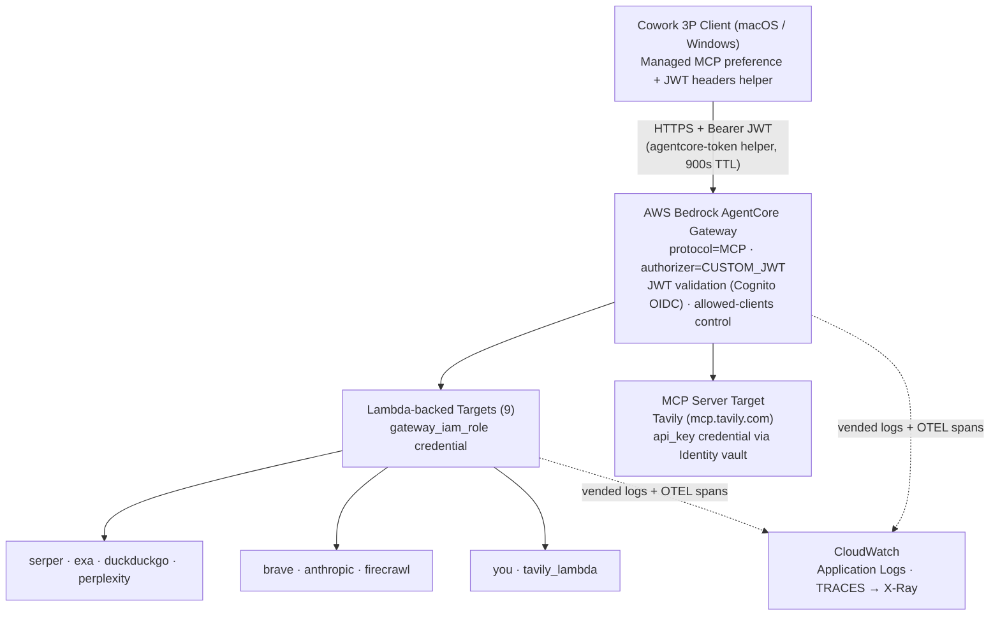
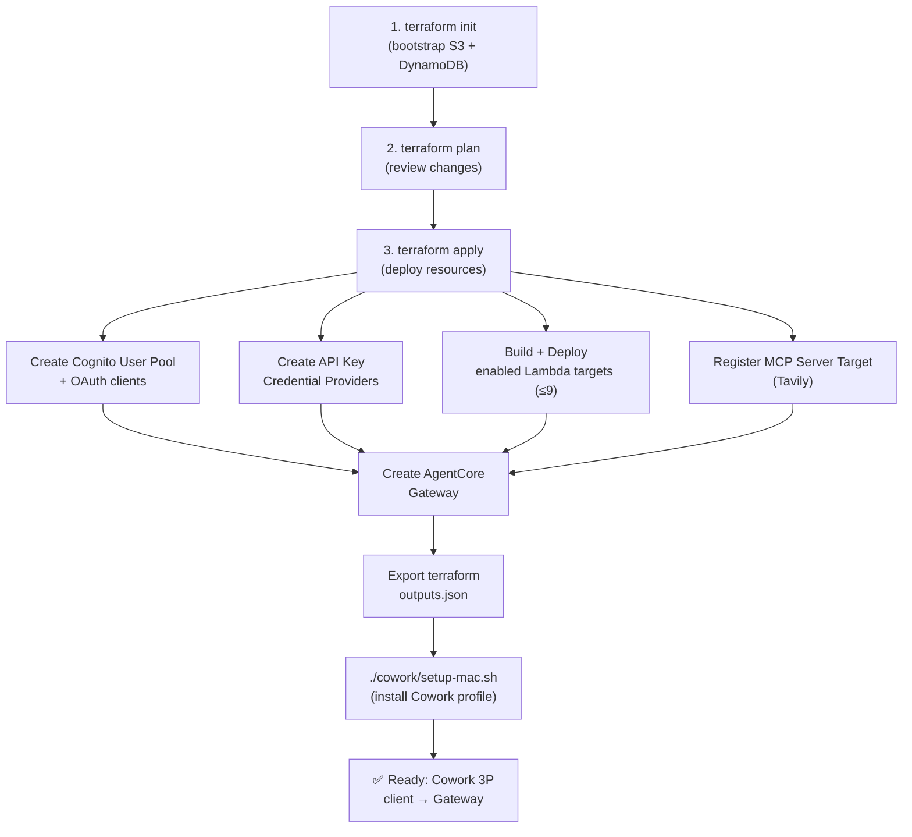

# WebSearch Tool Gateway — Technical Architecture

**Version**: 1.1 | **Date**: 2026-05-31 | **AWS Region**: us-east-1 (N. Virginia)

## Executive Summary

WebSearch Tool Gateway is a fully managed, Infrastructure-as-Code system that integrates multiple web search / extraction engines (Serper, Exa, DuckDuckGo, Perplexity, Brave, Anthropic, Firecrawl, You.com, Tavily) into AWS Bedrock AgentCore and provides unified access via Cowork 3P client integration.

**Key Metrics**:
- **4 deployment tracks**: Infra (Terraform), Tools (Python Lambda), Dashboard (Next.js), Cowork (setup automation)
- **6 Terraform modules**: auth, gateway, identity-providers, gateway-lambda-tool, gateway-mcp-target, observability
- **10 engines**: 9 Lambda-backed targets + 1 hosted MCP server target (Tavily). Each is toggled on via an `enable_<engine>` flag and only created when its API key is present (DuckDuckGo needs none).
- **Zero-trust architecture**: CUSTOM_JWT auth with Cognito allowed-clients access control
- **Full observability**: CloudWatch vended logs + metrics + X-Ray (OTEL) traces

---

## System Architecture



All nine Lambda targets expose the **same** MCP tool — `web_search(query, num_results?, country?)` — via an inline tool schema; the engine differs per target. The Tavily hosted MCP server is registered as a separate `mcpServer` target whose API key the gateway injects from the AgentCore Identity token vault (query parameter `tavilyApiKey`).

---

## Component Details

### 1. AWS Bedrock AgentCore Gateway

**Purpose**: Central MCP router with JWT-based access control.

**Responsibilities**:
- Accept MCP protocol requests (tool list, tool call); supported version `2025-11-25`
- Validate JWT tokens (Cognito OIDC discovery URL)
- Enforce access via the allowed-clients list (app + web + M2M client IDs)
- Route to Lambda targets or the external MCP server target
- Return normalized MCP responses

**Configuration** (`infra/modules/gateway/main.tf`):
```terraform
resource "aws_bedrockagentcore_gateway" "this" {
  name            = local.gateway_name
  role_arn        = aws_iam_role.gateway.arn
  authorizer_type = "CUSTOM_JWT"
  protocol_type   = "MCP"

  authorizer_configuration {
    custom_jwt_authorizer {
      discovery_url   = "${var.cognito_issuer_url}/.well-known/openid-configuration"
      allowed_clients = var.cognito_allowed_clients # [app, web, m2m] client IDs
    }
  }

  protocol_configuration {
    mcp {
      search_type        = "SEMANTIC"
      supported_versions = ["2025-11-25"]
    }
  }
}
```

Lambda and MCP-server targets are separate `aws_bedrockagentcore_gateway_target` resources (see sections 2–3), not an inline list.

---

### 2. Search Tools (Lambda)

**9 Lambda-backed targets** (`tools/<engine>/handler.py`, Python 3.12, **arm64**). Each is conditionally created from `enable_<engine>` + a non-empty API key (DuckDuckGo needs none). All expose the same MCP tool `web_search(query, num_results?, country?)`.

| Tool | Engine | API Key | Notes |
|------|--------|---------|-------|
| **serper** | Google Serper | `SERPER_API_KEY` | SERP results |
| **exa** | Exa | `EXA_API_KEY` | neural search |
| **duckduckgo** | DuckDuckGo | none | uses `ddgs` package |
| **perplexity** | Perplexity Sonar | `PERPLEXITY_API_KEY` | returns `answer` |
| **brave** | Brave Search | `BRAVE_API_KEY` | independent index |
| **anthropic** | Claude built-in web_search | `ANTHROPIC_API_KEY` | returns `answer`; snippet best-effort |
| **firecrawl** | Firecrawl | `FIRECRAWL_API_KEY` | search + extraction |
| **you** | You.com | `YOU_API_KEY` | web search |
| **tavily_lambda** | Tavily (Lambda-backed) | `TAVILY_API_KEY` | distinct from hosted MCP target |

**Common Interface** (`SearchResponse` contract, `tools/_shared/response.py`):

```python
{
  "results": [
    {"title": str, "url": str, "snippet": str,
     "score": float | None, "published_at": str | None},  # RFC3339
    ...
  ],
  "engine": str,           # e.g. "serper", "exa", "anthropic", ...
  "latency_ms": int,       # query execution time
  "answer": str            # OPTIONAL — present only when the engine returns
}                          #   a synthesized answer (anthropic, perplexity, tavily)
```

**API Key Management** (`tools/_shared/identity.py`):

`get_api_key(provider_name)` resolves the key in priority order:
1. A per-engine **environment variable** (e.g. `SERPER_API_KEY`) injected by Terraform — the primary path for Lambda targets.
2. **AgentCore Identity** `GetResourceApiKey` as a *fallback*, only attempted when `WORKLOAD_TOKEN` + `IDENTITY_PROVIDER_ARN` are present.

Resolved keys are cached in Lambda memory for the warm window.

**Environment Variables** (injected by Terraform):

```bash
<ENGINE>_API_KEY            # e.g. SERPER_API_KEY — primary key source
IDENTITY_PROVIDER_ARN       # credential provider ARN (Identity fallback)
WORKLOAD_TOKEN              # provided by AgentCore at runtime (fallback path)
PROJECT_NAME                # websearch-gw
ENVIRONMENT                 # dev
# AWS_REGION is reserved and injected by the Lambda runtime automatically.
```

---

### 3. External MCP Server Target (Tavily)

**1 hosted MCP server**, registered as an `mcpServer` target. The gateway injects the
API key from the AgentCore Identity token vault — `mcpServer` targets reject
`gateway_iam_role`, so an `api_key` credential provider is required.

| Tool | Endpoint | Credential injection |
|------|----------|----------------------|
| **tavily** | `https://mcp.tavily.com/mcp/` | `QUERY_PARAMETER` → `tavilyApiKey` |

> Note: Brave is **not** a hosted MCP target — it runs as a Lambda target (section 2).
> `tavily_lambda` is a separate Lambda-backed Tavily target distinct from this hosted one.

**Gateway Registration** (`infra/modules/gateway/main.tf`):

```terraform
resource "aws_bedrockagentcore_gateway_target" "mcp_server" {
  for_each           = var.mcp_server_targets
  gateway_identifier = aws_bedrockagentcore_gateway.this.gateway_id
  name               = each.key

  credential_provider_configuration {
    api_key {
      provider_arn              = var.mcp_server_credentials[each.key]
      credential_location       = "QUERY_PARAMETER"   # tavily
      credential_parameter_name = "tavilyApiKey"        # tavily
    }
  }

  target_configuration {
    mcp {
      mcp_server { endpoint = each.value }  # https://mcp.tavily.com/mcp/
    }
  }
}
```

---

### 4. Authentication (Cognito)

**Purpose**: OAuth 2.0 token issuance for Cowork clients and the dashboard.

**Components**:

1. **User Pool** + **Resource Server** (`identifier = "agentcore"`, scope `invoke` → `agentcore/invoke`)

2. **3 client types**:
   - **App client** (`${project}-app-client`): `client_credentials`, scope `agentcore/invoke` — CLI/M2M.
   - **Web client** (`${project}-web-client`): OAuth flows for the dashboard, scopes `openid email profile agentcore/invoke`.
   - **M2M client** (`${project}-m2m-client`): `client_credentials`, scope `agentcore/invoke` — service-to-service (Cowork helper, dashboard server routes).

   All three client IDs are passed to the gateway's `allowed_clients`.

3. **OIDC Configuration** (issuer = Cognito IdP URL, not the hosted-UI domain):
   - Discovery URL: `{issuer_url}/.well-known/openid-configuration`
   - Token endpoint: `https://{cognito_domain}/oauth2/token`
   - Issuer URL: `https://cognito-idp.us-east-1.amazonaws.com/{user_pool_id}`

**Access tokens** are obtained via the `client_credentials` grant (no interactive
browser login in the Cowork/dashboard paths — see [Token Refresh](#token-refresh-mechanism)):

```bash
POST https://{cognito_domain}/oauth2/token
  grant_type=client_credentials
  scope=agentcore/invoke
  # client_id + client_secret via HTTP Basic
```

The resulting JWT's `client_id`/`scope` claims are validated by the gateway against
`allowed_clients`.

---

### 5. Identity Providers (API Key Credential Providers)

**Purpose**: Hold API keys in the AgentCore Identity token vault. Used by:
- the **hosted MCP server target** (Tavily), where the gateway injects the key outbound, and
- Lambda handlers as a **fallback** when the per-engine env var is absent.

An `aws_bedrockagentcore_api_key_credential_provider` is created **only for engines
that have an API key** — `tavily`, `brave`, `serper`, `exa`, `perplexity`,
`anthropic`, `firecrawl`, `you`. **DuckDuckGo has no provider** (no key). The ARNs
are surfaced as `identity_provider_arns` (non-sensitive — ARNs are not secrets).

**Two credential paths** (see also `tools/_shared/identity.py`):

| Target kind | Key source |
|-------------|------------|
| Lambda targets | per-engine **env var** (e.g. `SERPER_API_KEY`) injected by Terraform; Identity vault is the fallback |
| MCP server target (Tavily) | gateway injects from the Identity vault as a query param |

**API Key Variables** (`terraform.tfvars`, all marked `sensitive`):

```hcl
serper_api_key     = "..."
exa_api_key        = "..."
perplexity_api_key = "..."
brave_api_key      = "..."
anthropic_api_key  = "..."
firecrawl_api_key  = "..."
you_api_key        = "..."
tavily_api_key     = "..."   # shared by hosted Tavily MCP target + tavily_lambda
# duckduckgo: no key required
```

> `infra/scripts/seed-api-keys.sh` can populate the Identity credential providers
> from `terraform.tfvars` after apply.

---

### 6. Observability (CloudWatch)

AgentCore delivers gateway logs and OTEL spans through **CloudWatch vended-log
deliveries** (log delivery source → destination → delivery), set up in
`infra/modules/observability`.

**Components**:

1. **Vended log groups** (keyed by gateway ID):
   - Application logs: `/aws/vendedlogs/bedrock-agentcore/gateway/APPLICATION_LOGS/{gateway_id}`
   - Traces: `/aws/vendedlogs/bedrock-agentcore/gateway/TRACES/{gateway_id}`
   - Retention configurable (`log_retention_days`).

2. **Metrics** (`Bedrock/AgentCore` namespace): emitted by AgentCore with
   per-tool / auth / api-key dimensions. Two gateways share the namespace, so
   metric queries must filter by gateway ARN/ID.

3. **Traces** (OTEL → X-Ray Transaction Search):
   - Gateway spans delivered to the TRACES log group and X-Ray.
   - Indexing for query is governed by the account/region-global **"Default"
     indexing rule**; at the 1% default sampling a low-traffic dev gateway looks
     empty. The rule is Terraform-managed via `manage_trace_indexing_rule` +
     `trace_sampling_percentage` (dev = 100).
   - Gateway spans/logs carry **no `client_id`/`sub`** — "who called" is not in
     telemetry; join logs↔traces by `trace_id` instead.

---

## Cowork 3P Integration

Authentication uses the Cognito **M2M `client_credentials`** grant — there is no
interactive browser/authorization-code login. Cowork reads a fresh `Authorization`
header from a **headers helper** script before each request (TTL 900s).

### Setup Flow (macOS)

```bash
$ ./setup-mac.sh
  ├─ 1. Read Terraform outputs (cognito_domain, gateway_url, m2m client id/secret, scope)
  ├─ 2. Fetch an initial access token via client_credentials grant
  ├─ 3. Write config + token cache under ~/.websearch-gw/ (chmod 600)
  ├─ 4. Render mobileconfig from template:
  │   ├─ Gateway URL (transport: http)
  │   ├─ headersHelper path (agentcore-token.sh)
  │   └─ headersHelperTtlSec = 900
  ├─ 5. Install the configuration profile
  └─ 6. Install helper scripts (agentcore-token.sh)
```

Windows uses `setup-windows.ps1`, which writes the equivalent `managedMcpServers`
registry value. Both have matching `uninstall-*` scripts.

### Token Refresh Mechanism

**Helper Script** (`agentcore-token.sh`) — called by Cowork (per `headersHelperTtlSec`):

```bash
# Refresh if the cached token expires within 60 seconds
if [ current_time >= expires_at - 60 ]; then
  # Re-mint via M2M client credentials (NOT refresh_token)
  curl -s -X POST "${COGNITO_DOMAIN}/oauth2/token" \
    -u "${CLIENT_ID}:${CLIENT_SECRET}" \
    -d "grant_type=client_credentials&scope=${SCOPE:-agentcore/invoke}"
fi
# Emit the header object Cowork expects
echo "{\"Authorization\": \"Bearer <access_token>\"}"
```

**Cowork Config** (`templates/cowork-3p.mobileconfig.tmpl`):

```xml
<key>managedMcpServers</key>
<array>
  <dict>
    <key>url</key>            <string>{gateway_url}</string>
    <key>transport</key>      <string>http</string>
    <key>name</key>           <string>AgentCore Gateway</string>
    <key>headersHelper</key>  <string>{headers_helper}</string>
    <key>headersHelperTtlSec</key> <integer>900</integer>
  </dict>
</array>
```

---

## Dashboard (Next.js 16)

**Purpose**: Local web UI for testing, monitoring, and configuration.

**Pages**:

| Path | Purpose | AWS Integration |
|------|---------|-----------------|
| `/` | Home / gateway overview | `/api/access` (AgentCore GetGateway + ListTargets) |
| `/inspector` | MCP tool tester | Gateway tools/list + tools/call |
| `/observability` | Metrics dashboard | CloudWatch GetMetricData |
| `/traces` | X-Ray trace explorer | X-Ray Transaction Search (GetTraceSummaries) |
| `/playground` | Multi-engine search compare | Parallel fan-out + LLM judge |
| `/audit` | Logs Insights | CloudWatch StartQuery + GetQueryResults |

**API Routes** (server-side only):

```
/api/access              → GET  gateway access overview (targets, allowed clients)
/api/mcp/list            → GET/POST gateway tools
/api/mcp/call            → POST tool execution
/api/mcp/parallel-search → POST fan-out across engines (Playground)
/api/cw/metrics          → GET  CloudWatch metrics
/api/cw/logs             → GET  Logs Insights results (Audit)
/api/xray/traces         → GET  trace summaries
/api/xray/traces/[id]    → GET  single trace detail
/api/eval/judge          → POST LLM-as-judge scoring (Playground)
/api/auth/login          → POST Cognito client_credentials token
```

---

## Terraform Module Structure

### Module: `auth`

**Outputs**:
- `user_pool_id` — Cognito User Pool ID
- `domain` — Cognito domain (for OAuth endpoints)
- `web_client_id` — Web client ID (Cowork interactive)
- `m2m_client_id` — M2M client ID (service-to-service)
- `resource_server_id` — Custom resource server ID
- `issuer_url` — OIDC issuer URL

### Module: `identity-providers`

**Creates an API-key credential provider only for engines that have a key**
(no provider for keyless DuckDuckGo): `tavily`, `brave`, `serper`, `exa`,
`perplexity`, `anthropic`, `firecrawl`, `you` — each gated by
`enable_<engine>` + non-empty key. Outputs the `name → ARN` map.

### Module: `gateway-lambda-tool`

Instantiated once **per enabled Lambda tool** (`for_each`). For each:
1. Build deployment package (handler + `_shared/` + dependencies), Python 3.12 / arm64
2. Create IAM role + policies
3. Create CloudWatch log group
4. Deploy the Lambda function (name `{project}-{env}-tool-{engine}`)

### Module: `gateway-mcp-target`

Registers external **MCP server** endpoints (currently Tavily) and wires each to
its API-key credential provider.

### Module: `gateway`

**Creates the AgentCore Gateway** (`protocol_type=MCP`, `authorizer_type=CUSTOM_JWT`):
1. Registers Lambda targets (`gateway_iam_role` credential, inline `web_search` schema)
   and MCP-server targets (`api_key` credential)
2. Configures the CUSTOM_JWT authorizer (Cognito discovery URL + allowed clients)
3. Outputs gateway URL + ID

### Module: `observability`

**CloudWatch / X-Ray setup**:
1. Create vended-log groups (APPLICATION_LOGS, TRACES)
2. Wire log delivery source → destination → delivery
3. Optionally manage the X-Ray "Default" indexing rule + set retention

---

## Deployment Flow



---

## Data Flow Example: Query "python async"

```
1. Cowork Client Request:
   POST https://{gateway_url}/mcp
   Headers: Authorization: Bearer {JWT_TOKEN}
   Body: {
     "jsonrpc": "2.0",
     "id": 1,
     "method": "tools/call",
     "params": {
       "name": "serper___web_search",
       "arguments": {
         "query": "python async",
         "num_results": 10
       }
     }
   }
   # Tool names are namespaced <target>___web_search; every Lambda target
   # exposes the same web_search tool, distinguished by target name.

2. Gateway Processing:
   - Validate JWT (Cognito OIDC issuer)
   - Verify caller is in the allowed-clients list ✓
   - Route to the Lambda target: serper
   
3. Lambda Execution:
   - Extract query + num_results
   - Resolve API key: SERPER_API_KEY env var (Identity vault fallback)
   - Call Serper API: https://google.serper.dev/search?q=python+async
   - Normalize response → SearchResponse
   - Return to Gateway
   
4. Gateway Response (MCP tools/call result — payload is JSON-encoded in content[].text):
   {
     "jsonrpc": "2.0",
     "id": 1,
     "result": {
       "isError": false,
       "content": [
         {"type": "text", "text": "{\"results\":[...],\"engine\":\"serper\",\"latency_ms\":523}"}
       ]
     }
   }

5. Observability:
   - Vended log entry for the gateway invocation
   - Bedrock/AgentCore metrics (per-tool dimensions)
   - OTEL span delivered to the TRACES log group + X-Ray (join by trace_id)
```

---

## Scalability & Limits

| Component | Soft Limit | Hard Limit | Notes |
|-----------|-----------|-----------|-------|
| Lambda concurrent executions | 1000 (default AWS) | 10,000 | Configurable per region |
| CloudWatch Logs ingestion | 10 MB/s | 100 MB/s | Partition key per tool |
| MCP / Lambda targets | 20 | 100 | Lambda + MCP-server mixed |

**Optimization Tips**:
- Use Lambda warm starts (reserved concurrency if needed)
- Keep CloudWatch Logs retention short in dev (`log_retention_days`)

---

## Security & Compliance

**Authentication**:
- ✅ CUSTOM_JWT (Cognito OIDC discovery URL)
- ✅ No API keys in client headers; outbound keys injected from the Identity vault / env vars
- ✅ Token re-minted via M2M `client_credentials` (refreshed ≤60s before expiry)

**Authorization**:
- ✅ Allowed-clients list (app + web + M2M client IDs)
- ✅ IAM roles (Lambda, Gateway)
- ✅ Resource-level permissions

**Data Protection**:
- ✅ HTTPS/TLS for all communications
- ✅ Encryption in transit (AWS managed)
- ✅ Encryption at rest (CloudWatch Logs, S3 state)
- ✅ No plaintext secrets in code (Terraform tfvars marked sensitive)

**Audit & Compliance**:
- ✅ CloudWatch vended logs (immutable, timestamped)
- ✅ X-Ray traces (request traceability via `trace_id`)

---

## Troubleshooting

### Issue: "INVALID_JWT" / unauthorized from Gateway

**Cause**: Token expired, wrong scope, or client not in allowed-clients.

**Solution**:
```bash
# Re-mint a token and inspect claims
./cowork/agentcore-token.sh        # prints the Authorization header
# Verify the gateway's allowed_clients include this client_id
```

### Issue: Lambda function timeout (>60s)

**Cause**: Search API slow or network latency.

**Solution**:
```hcl
# Increase timeout in Terraform
module "lambda_tools" {
  timeout = 120  # 2 minutes
}
```

### Issue: High CloudWatch Logs costs

**Cause**: Verbose logging or long retention.

**Solution**:
```hcl
# Reduce retention
log_retention_days = 7  # default 30
```

---

## Roadmap

- [ ] Parallel search aggregation (combine results from multiple engines)
- [ ] Search result caching (30-min TTL per query)
- [ ] Advanced policy rules (ML-based content filtering)
- [ ] Multi-region failover
- [ ] Custom tool support (BYOC - Bring Your Own Connector)

---

## References

- AWS Bedrock AgentCore: https://docs.aws.amazon.com/bedrock-agentcore/
- Cognito OAuth 2.0: https://docs.aws.amazon.com/cognito/
- Lambda: https://docs.aws.amazon.com/lambda/
- CloudWatch: https://docs.aws.amazon.com/cloudwatch/
- Cowork 3P Integration: [Local file: cowork/README.md]
