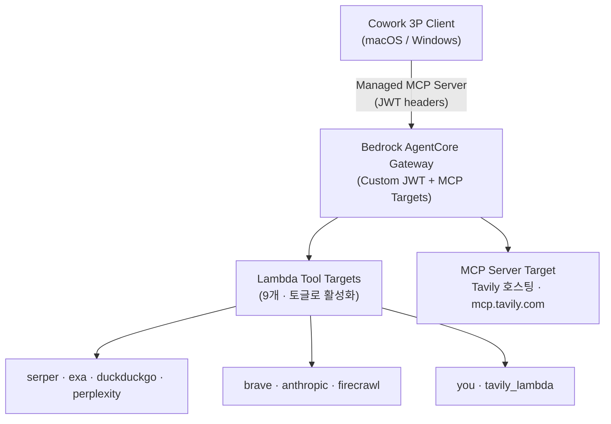

# WebSearch Tool Gateway

**통합 검색 엔진 게이트웨이 with Bedrock AgentCore**

## 30초 소개

WebSearch Tool Gateway는 AWS Bedrock AgentCore를 통해 여러 검색·추출 엔진(Serper, Exa, DuckDuckGo, Perplexity, Brave, Anthropic, Firecrawl, You.com, Tavily)을 단일 MCP 게이트웨이로 통합하고, Cowork 3P 클라이언트를 통해 Claude에게 접근을 제공하는 완전 관리형 인프라입니다.



### 핵심 기능

- **Unified Search Interface**: 9개 Lambda 엔진 + 1개 호스팅 MCP 타겟(Tavily) 통합, API 키 유무에 따라 토글
- **AgentCore Gateway**: JWT 기반 인증, 허용 클라이언트 기반 접근 제어
- **Cowork Integration**: macOS/Windows 자동 설정/제거 (idempotent setup/uninstall scripts)
- **Observability**: CloudWatch Logs + Metrics + X-Ray 트레이스 (대시보드 연동)
- **Infrastructure as Code**: Terraform 기반 완전 자동화 배포

---

## 5분 빠른 시작

### 전제 조건

- AWS 계정 (us-east-1 리전)
- Terraform 1.7+
- AWS CLI v2
- macOS/Linux 또는 Windows PowerShell

### 1단계: 인프라 배포

```bash
cd infra/environments/dev

# terraform.tfvars 생성 (엔진 토글 + API 키 입력)
cp terraform.tfvars.example terraform.tfvars
# 편집: enable_* 플래그와 serper_api_key, exa_api_key, perplexity_api_key 등

# 배포
terraform init
terraform plan
terraform apply
```

> 각 엔진은 `enable_<engine>` 플래그로 켜고 끕니다. 키가 비어 있으면 해당 Lambda/타겟은 생성되지 않습니다. DuckDuckGo는 API 키 없이 동작합니다.

배포 완료 후:
```bash
terraform output -json > ../../../outputs.json
```

### 2단계: Cowork 3P 클라이언트 설정 (macOS)

```bash
cd cowork
./setup-mac.sh
# → Cognito M2M 토큰 생성 → mobileconfig 렌더링 → 설치
```

**Windows:**
```powershell
cd cowork
.\setup-windows.ps1
# → Windows 레지스트리 업데이트
```

### 3단계: 대시보드 실행 (옵션, 로컬 테스트용)

```bash
cd dashboard
cp .env.example .env.local
# terraform outputs를 .env.local에 입력

pnpm install
pnpm dev
# → http://localhost:3000
```

---

## 상세 문서

각 워크트랙별 기술 가이드:

### infra/ — Terraform IaC

**배포 가이드**: [infra/README.md](./infra/README.md)
- 모듈 구조 (auth, gateway, identity-providers, observability)
- 환경 변수 및 API 키 관리
- 배포 및 파괴 스크립트

### tools/ — Python Lambda 핸들러

**개발 가이드**: [tools/README.md](./tools/README.md)
- Lambda 핸들러 9종 (serper, exa, duckduckgo, perplexity, brave, anthropic, firecrawl, you, tavily_lambda)
- 공유 `SearchResponse` 계약 스키마 (`_shared/response.py`)
- API 키 관리: env-var 직접 주입 또는 AgentCore Identity 조회 (`_shared/identity.py`)
- 테스트 (`tools/tests/test_handlers.py`) 및 패키징

### dashboard/ — Next.js 16 대시보드

**기술 설명**: [dashboard/README.md](./dashboard/README.md)
- 페이지별 기능 (Inspector, Observability, Traces, Playground, Audit)
- API 라우트 및 서버사이드 AWS SDK 호출 (`/api/access`, `/api/mcp`, `/api/cw`, `/api/xray`, `/api/eval`)
- 로컬 개발 환경 설정

### cowork/ — Cowork 3P 설정

**설정 가이드**: [cowork/README.md](./cowork/README.md)
- macOS mobileconfig 렌더링 및 설치
- Windows 레지스트리 업데이트
- 토큰 갱신 메커니즘 (JWT auto-refresh)

---

## 디렉토리 구조

```
websearch-tool-gateway/
├── README.md                  # 이 파일
├── .gitignore                 # 보안: 상태 파일, 환경 변수 제외
├── ARCHITECTURE.md            # 기술 아키텍처 (영문)
│
├── infra/                     # Terraform IaC
│   ├── README.md              # 배포 가이드
│   ├── bootstrap/             # S3 + DynamoDB 상태 관리
│   ├── environments/dev/      # dev 환경 설정 (main.tf, terraform.tfvars.example)
│   ├── modules/               # auth, gateway, gateway-lambda-tool,
│   │                          #   gateway-mcp-target, identity-providers, observability
│   └── scripts/               # 자동화 (deploy.sh, destroy.sh, seed-api-keys.sh)
│
├── tools/                     # Python 3.12 Lambda 핸들러
│   ├── README.md              # 개발 가이드
│   ├── pyproject.toml         # 패키지 설정
│   ├── requirements*.txt      # 런타임 / dev 의존성
│   ├── _shared/               # 공유 라이브러리
│   │   ├── identity.py        # AgentCore API 키 조회
│   │   ├── response.py        # SearchResponse 정규화
│   │   ├── otel.py            # OpenTelemetry 트레이싱
│   │   └── constants.py       # 상수 및 제한값
│   ├── serper/  exa/  duckduckgo/  perplexity/   # 검색 엔진 핸들러
│   ├── brave/  anthropic/  firecrawl/  you/      # 추가 검색/추출 핸들러
│   ├── tavily_lambda/         # Lambda 백엔드 Tavily (호스팅 MCP와 별개)
│   └── tests/                 # test_handlers.py
│
├── dashboard/                 # Next.js 16 대시보드
│   ├── package.json           # pnpm 의존성
│   ├── .env.example           # 환경 변수 템플릿
│   ├── src/
│   │   ├── app/               # Next.js 앱 라우터
│   │   │   ├── inspector/     # MCP 도구 인스펙터
│   │   │   ├── observability/ # CloudWatch 메트릭
│   │   │   ├── traces/        # X-Ray 트레이스 조회
│   │   │   ├── playground/    # 다중 엔진 비교
│   │   │   ├── audit/         # Logs Insights 로그 조회
│   │   │   └── api/           # 서버사이드 라우트 (access, mcp, cw, xray, eval, auth)
│   │   ├── lib/               # 유틸리티 (AWS 타입, MCP 클라이언트, constants)
│   │   └── components/        # shadcn/ui 컴포넌트 + shell(nav)
│   └── public/                # 정적 자산
│
├── cowork/                    # Cowork 3P 설정
│   ├── README.md              # 설정 가이드
│   ├── setup-mac.sh / setup-windows.ps1        # 자동 설정
│   ├── uninstall-mac.sh / uninstall-windows.ps1 # 설정 제거
│   ├── agentcore-token.sh / agentcore-token.ps1 # JWT 갱신 헬퍼
│   └── templates/             # mobileconfig + registry 템플릿
│
└── docs/                      # 한글 가이드 (추가 리소스)
    ├── 01-deployment-guide.md
    ├── 02-cowork-setup-mac.md
    ├── 02-cowork-setup-windows.md
    ├── 03-observability.md
    └── 04-troubleshooting.md
```

---

## 아키텍처 (기술)

전체 시스템 아키텍처는 [ARCHITECTURE.md](./ARCHITECTURE.md)를 참고하세요.

**핵심 컴포넌트**:

1. **Bedrock AgentCore Gateway** — JWT 인증 기반 중앙 MCP 라우터
2. **Lambda Tool Targets** — 검색/추출 API 래퍼 9종 (serper, exa, duckduckgo, perplexity, brave, anthropic, firecrawl, you, tavily_lambda)
3. **MCP Server Target** — 외부 호스팅 MCP 서버 (Tavily, `mcp.tavily.com`)
4. **Identity Providers** — AgentCore API Key Credential Provider (엔진별 키 보관)
5. **Cognito User Pool** — M2M + App + Web 클라이언트 인증
6. **CloudWatch + X-Ray Observability** — Vended logs + metrics + traces

---

## 일반적인 작업

### API 키 추가/변경

```bash
cd infra/environments/dev
# terraform.tfvars 편집
terraform apply
```

### 로그 조회

```bash
# 게이트웨이 ID는 terraform output gateway_id 로 확인
# 대시보드의 /audit 페이지 또는:
aws logs start-query \
  --log-group-name "/aws/vendedlogs/bedrock-agentcore/gateway/APPLICATION_LOGS/<gateway-id>" \
  --start-time $(date -d '1 hour ago' +%s) \
  --end-time $(date +%s) \
  --query-string 'fields @timestamp, @message | filter @message like /error/ | stats count() by bin(1m)'
```

### 환경 초기화 (개발)

```bash
cd infra
./scripts/destroy.sh  # 대화형 확인 후 모든 리소스 제거
```

---

## 문제 해결

### Cowork 설정 실패

1. Terraform 출력 확인:
   ```bash
   cd infra/environments/dev
   terraform output gateway_url
   terraform output cognito_domain
   ```

2. JWT 토큰 갱신 로그 확인:
   ```bash
   cat ~/.websearch-gw/agentcore-token.log
   ```

3. mobileconfig 설치 재시도:
   ```bash
   cd cowork
   ./setup-mac.sh --force-login
   ```

### Lambda 함수 테스트

```bash
# 함수명 규칙: <project_name>-<environment>-tool-<engine> (기본 websearch-gw-dev-tool-serper)
aws lambda invoke \
  --function-name websearch-gw-dev-tool-serper \
  --payload '{"query": "test", "num_results": 5}' \
  --region us-east-1 \
  response.json
cat response.json | jq
```

### CloudWatch 메트릭 확인

```bash
aws cloudwatch get-metric-statistics \
  --namespace Bedrock/AgentCore \
  --metric-name GatewayInvocations \
  --dimensions Name=GatewayId,Value=<gateway-id> \
  --statistics Sum Average \
  --start-time $(date -d '1 hour ago' -Iseconds) \
  --end-time $(date -Iseconds) \
  --period 300 \
  --region us-east-1
```

---

## 보안 고려사항

- ✅ **상태 파일**: S3 암호화 + DynamoDB 잠금 (Terraform backend)
- ✅ **API 키**: AgentCore Identity Credential Provider 보관 또는 Lambda 환경변수 주입 (Terraform 변수는 `sensitive=true`)
- ✅ **접근 제어**: JWT 인증 + 허용 클라이언트 목록 (Cognito M2M / App / Web)
- ✅ **JWT 토큰**: 만료 전 자동 갱신 (Cowork 클라이언트)
- ✅ **로그**: CloudWatch Vended Logs + X-Ray 트레이스 중앙화 (감사 추적)

**주의**: `terraform.tfvars` 및 `.env.local` 파일을 git에 커밋하지 마세요.

---

## 기여

이 프로젝트는 완전 자동화된 멀티 워크트랙 시스템입니다.

- **infra/**: Terraform 모듈 수정 시 `terraform fmt -recursive .` 실행
- **tools/**: Python 핸들러 수정 시 `pytest` 실행
- **dashboard/**: UI 변경 시 `pnpm build` 검증
- **cowork/**: 스크립트 수정 시 macOS/Windows 양쪽 테스트

---

## 라이선스

AWS 샘플 코드. MIT 라이선스 참고.

---

## 지원

- 📖 [ARCHITECTURE.md](./ARCHITECTURE.md) — 기술 아키텍처
- 📋 [infra/README.md](./infra/README.md) — 배포 세부사항
- 🛠️ [tools/README.md](./tools/README.md) — Lambda 개발
- 🎨 [dashboard/README.md](./dashboard/README.md) — Next.js 기술
- 🔧 [cowork/README.md](./cowork/README.md) — Cowork 설정
